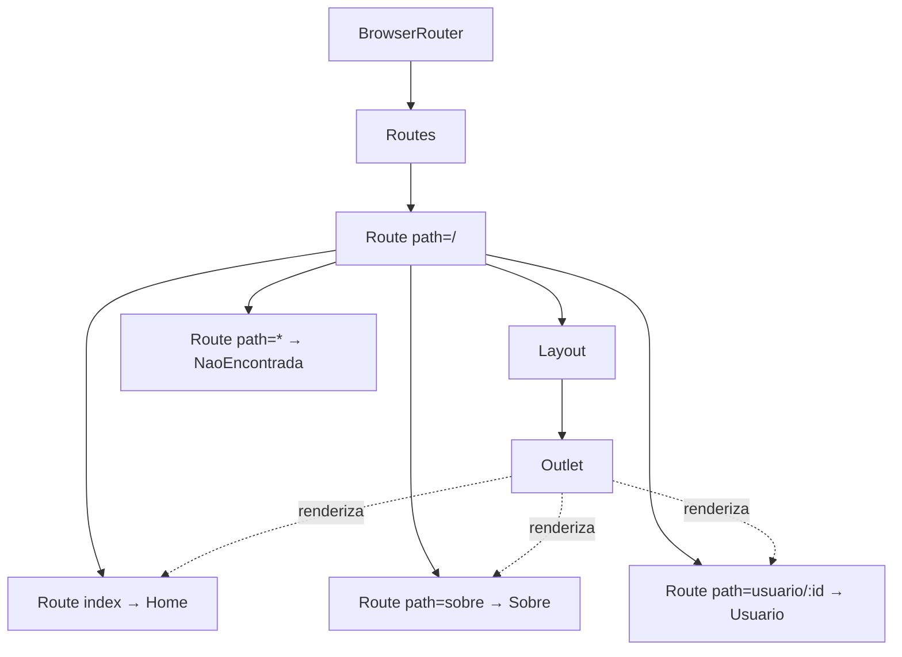

# Rotas no frontend (SPA e React Router v7)

## Introdução

Em uma **Single Page Application (SPA)**, a aplicação é carregada uma vez e a navegação entre "telas" acontece no próprio frontend, sem recarregar a página. As **rotas** definem qual componente deve ser exibido para cada URL (ex.: `/`, `/sobre`, `/usuarios/123`). No ecossistema React, a biblioteca mais usada para isso é o **React Router**, atualmente na versão **v7**.

A v7 unificou React Router e Remix. Você continua podendo usar o modo "declarativo" com `<BrowserRouter>` e `<Routes>`, e ganhou o modo **Data Router** com `createBrowserRouter`, que suporta loaders, actions, defer e melhor integração com Suspense. Este curso cobre o modo declarativo (mais didático) e faz uma introdução ao modo Data.

---

## Conceitos principais

- **Rota**: associação entre um caminho (path) e um componente. Ex.: path `/contato` → componente `Contato`.
- **Router**: componente que envolve a aplicação e lê a URL para decidir o que renderizar (`BrowserRouter` usa a API History do navegador).
- **Routes / Route**: definem as rotas. Dentro de `<Routes>`, cada `<Route>` tem um `path` e um `element`.
- **Link / NavLink**: componentes de navegação; geram `<a>` mas evitam recarregar a página.
- **useNavigate**: hook para navegar programaticamente (ex.: após login, redirecionar para `/dashboard`).
- **useParams**: hook para ler parâmetros dinâmicos da URL (`/usuarios/:id` → `{ id }`).
- **Outlet**: ponto em um layout onde o React Router renderiza o componente filho da rota correspondente.

### Diagrama da árvore de rotas



---

## Rotas protegidas

Para páginas que exigem autenticação, crie um componente (ex.: `RotaProtegida`) que usa o contexto de autenticação: se o usuário não estiver logado, renderiza `<Navigate to="/login" />`; caso contrário, renderiza os filhos. Assim, rotas como `/dashboard` só ficam acessíveis para autenticados.

---

## Boas práticas

- Centralize a definição de rotas em um único lugar (`App.jsx` ou `routes.jsx`).
- Use **rotas aninhadas** e `Outlet` para **layouts compartilhados** (cabeçalho, menu) com conteúdo que muda.
- Para 404, use `<Route path="*" element={<NaoEncontrada />} />`.
- Use **`<NavLink>`** (em vez de `<Link>`) quando quiser estilo "ativo" automático.
- Em apps grandes, considere **lazy loading** das páginas: `const Home = lazy(() => import('./pages/Home'))` + `<Suspense>`.

---

## Modo Data Router (v7)

Se você precisar carregar dados antes de renderizar a rota (SSR-style), use `createBrowserRouter`:

```jsx
import { createBrowserRouter, RouterProvider } from 'react-router-dom';

const router = createBrowserRouter([
  {
    path: '/',
    element: <Layout />,
    children: [
      { index: true, element: <Home />, loader: async () => await fetchInicio() },
      { path: 'usuario/:id', element: <Usuario />, loader: usuarioLoader },
    ],
  },
]);

export default function App() {
  return <RouterProvider router={router} />;
}
```

- **`loader`**: roda antes do render e fornece dados via `useLoaderData()`.
- **`action`**: recebe submissões de `<Form>` (do React Router) — integra com forms.
- **`errorElement`**: exibido se loader/action lançar erro.

Neste curso, os tutoriais usam o modo declarativo por ser mais didático; o modo Data é apresentado para referência.

---

## Conclusão

O React Router v7 permite construir SPAs com URLs legíveis e navegação fluida. Dominar `Route`, `Link`, `useNavigate`, `useParams` e `Outlet` é suficiente para a maioria das aplicações; rotas protegidas são implementadas verificando o estado de autenticação antes de renderizar o conteúdo. No [tutorial-rotas.md](tutorial-rotas.md) você configurará rotas, links e parâmetros na prática.
