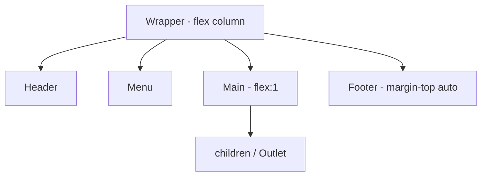

# Layouts em aplicações React

## Introdução

O **layout** é a estrutura visual que se repete em várias páginas: cabeçalho, menu, sidebar, área de conteúdo principal e rodapé. Em React, layouts são implementados como componentes que recebem o conteúdo variável (por props, `children` ou, com React Router v7, `Outlet`) e aplicam CSS (ou componentes de UI) para posicionar e estilizar os blocos.

## Diagrama



---

## Conceitos

- **Componente de layout**: um componente que define a estrutura (ex.: `<Header />`, `<Sidebar />`, `<main>{children}</main>`) e estilos comuns. O conteúdo que muda (página atual) é injetado via `children` ou `Outlet`.
- **CSS**: Flexbox e Grid são as ferramentas principais para organizar o layout. Flexbox para alinhar itens em uma dimensão (linha ou coluna); Grid para grades em duas dimensões.
- **Responsividade**: use media queries ou propriedades como `flex-wrap` e `grid-template-columns` com unidades fluidas (`fr`, `%`, `minmax`) para que o layout se adapte a diferentes larguras de tela. Muitas vezes o menu vira um “hamburger” em telas pequenas.
- **Estilização**: use **CSS Modules** para os componentes de layout (Header, Menu, Layout), mantendo um `.module.css` por componente. Coloque as media queries dentro do próprio module do layout para manter responsividade e estilos juntos.

---

## Estruturas comuns

- **Header + conteúdo + footer**: uma coluna; header e footer com altura fixa ou automática, conteúdo com `flex: 1` para ocupar o espaço restante.
- **Sidebar + conteúdo**: duas colunas (sidebar fixa ou colapsável + área principal); em mobile, sidebar pode ficar oculta ou sobreposta (drawer).
- **Dashboard**: grid com cards ou seções; cada célula pode ser um componente que consome dados.

---

## Integração com React Router v7

Com React Router, o layout é tipicamente uma rota pai que renderiza `Outlet`. As rotas filhas são as "páginas"; o layout envolve todas elas, então o cabeçalho e o menu permanecem e só o conteúdo dentro do `Outlet` muda.

## Dica: Document Metadata (React 19)

Em React 19 você pode colocar `<title>`, `<meta>` e `<link>` diretamente dentro do seu layout ou páginas — o React hoista para o `<head>`. Útil para dar título dinâmico por página:

```jsx
function Sobre() {
  return (
    <>
      <title>Sobre — Minha App</title>
      <meta name="description" content="Página sobre o projeto" />
      <h2>Sobre</h2>
    </>
  );
}
```

---

## Conclusão

Layouts em React são componentes que definem a estrutura e o estilo da aplicação e recebem o conteúdo dinâmico. CSS (Flexbox/Grid) e responsividade são a base; com React Router, o layout fica na rota pai e o conteúdo das páginas no `Outlet`. No [tutorial-layouts.md](tutorial-layouts.md) você construirá um layout com header, menu e área de conteúdo responsiva.
