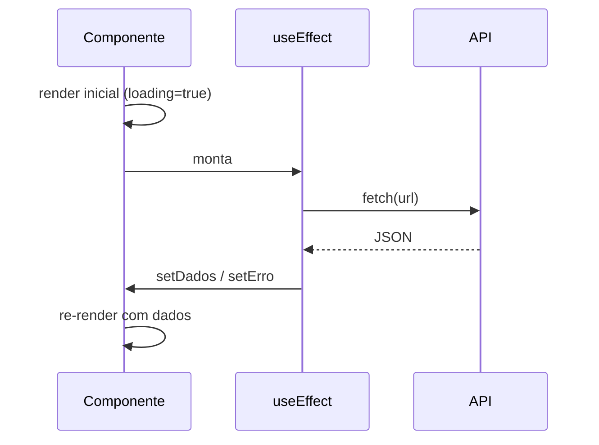

# Integração com APIs

## Introdução

A maioria das aplicações React precisa trocar dados com um servidor: buscar listas, enviar formulários, atualizar ou excluir registros. Isso é feito por meio de **requisições HTTP** a **APIs** (em geral REST, expostas como URLs que respondem com JSON). No frontend, as ferramentas mais usadas são **`fetch`** (nativo do navegador) e a biblioteca **axios**.

Em React 19, além dos padrões clássicos (`useEffect` + `useState`), surgiram alternativas modernas para envio de dados (**Actions** + `useActionState`) e leitura de promises (`use` + Suspense).

---

## Conceitos

- **REST**: estilo de API em que recursos são identificados por URLs; verbos HTTP (`GET`, `POST`, `PUT`, `PATCH`, `DELETE`) indicam a ação. Respostas costumam ser em JSON.
- **`fetch`**: API nativa do navegador para HTTP. Retorna uma Promise; é preciso chamar `.json()` no corpo da resposta para obter o objeto JavaScript.
- **axios**: biblioteca que simplifica requisições (interceptors, transformação automática de JSON, tratamento de erros, suporte a cancelamento). Muito usada em projetos React.
- **Estados da requisição**: ao chamar uma API, a aplicação passa por estados: **loading** (carregando), **success** (dados recebidos), **error** (falha). É importante tratar os três na UI.

### Fluxo clássico (GET com useEffect)



### Fluxo com Action (POST no React 19)

```mermaid
sequenceDiagram
    participant F as &lt;form action={formAction}&gt;
    participant UAS as useActionState
    participant API as API

    F->>UAS: submit
    UAS->>UAS: isPending = true
    UAS->>API: fetch(POST ...)
    API-->>UAS: resposta
    UAS->>F: state atualizado<br/>isPending = false
```

---

## Boas práticas

- **GET em listagens**: `useEffect` + `useState` resolve o caso simples. Em apps reais, use **TanStack Query** para cache, refetch automático e invalidação.
- **POST/PUT/DELETE (formulários)**: prefira **`useActionState`** e `<form action={formAction}>` no React 19 — reduz bugs e boilerplate.
- **Tratamento de erros**: use `try/catch` em chamadas assíncronas e defina um estado de erro; exiba uma mensagem amigável.
- **Cancelar requisições**: em componentes que podem desmontar antes da resposta, use `AbortController` (com fetch) ou `signal` (axios) para evitar atualizar estado em componente desmontado.
- **URLs e credenciais**: não coloque chaves de API no frontend. Use variáveis de ambiente do Vite (`import.meta.env.VITE_API_URL`) e deixe operações sensíveis no backend.
- **Tipos**: em projetos TypeScript, tipar o retorno da API evita muitos bugs.

---

## Padrões modernos no React 19

### 1. Actions para submissão

```jsx
async function criarUsuario(prev, formData) {
  const res = await fetch('/api/usuarios', {
    method: 'POST',
    body: JSON.stringify(Object.fromEntries(formData)),
    headers: { 'Content-Type': 'application/json' },
  });
  if (!res.ok) return { ok: false, erro: 'Falha ao criar' };
  return { ok: true, usuario: await res.json() };
}

// Dentro do componente:
const [state, formAction, isPending] = useActionState(criarUsuario, { ok: false });
```

### 2. Leitura com `use` + Suspense

```jsx
function Lista({ listaPromise }) {
  const itens = use(listaPromise); // suspende até resolver
  return <ul>{itens.map((i) => <li key={i.id}>{i.nome}</li>)}</ul>;
}
```

Em apps cliente puros, a Promise precisa ser estável (use `useMemo`) ou gerenciada por uma lib como **TanStack Query**; o padrão brilha em frameworks com Server Components.

---

## Conclusão

Integrar com APIs envolve fazer requisições HTTP, gerenciar loading/erro/sucesso e exibir dados na interface. Para listagens, o padrão `useEffect`+`useState` (ou TanStack Query) segue sendo adequado; para formulários e ações, `useActionState` é a nova forma idiomática. Os tutoriais [tutorial-formulario-crud.md](tutorial-formulario-crud.md) e [tutorial-listagem-api.md](tutorial-listagem-api.md) mostram ambos os padrões.
