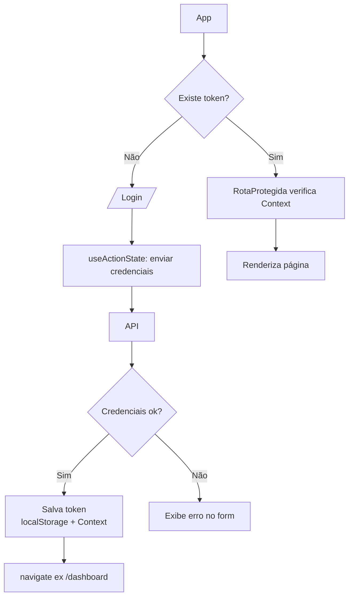

# Autenticação em aplicações React

## Introdução

**Autenticação** é o processo de identificar o usuário (quem é) e, em geral, verificar que ele tem direito de acessar certas partes da aplicação. No contexto de frontends React que consomem APIs, o fluxo típico é: o usuário envia credenciais (ex.: email e senha) para o backend; o servidor valida e devolve um **token** (ex.: JWT); o frontend armazena esse token e o envia em requisições subsequentes para acessar recursos protegidos.

---

## Conceitos principais

- **Login**: envio de credenciais (POST para `/login` ou similar); resposta com token e, às vezes, dados do usuário.
- **Token**: string que o servidor usa para reconhecer o usuário sem pedir senha a cada requisição. Costuma ser enviado no header `Authorization: Bearer <token>`.
- **Armazenamento do token**: no navegador, o token pode ser guardado em **localStorage** (persiste ao fechar o navegador) ou **sessionStorage** (perde ao fechar a aba). Ambos são acessíveis por JavaScript; para aplicações sensíveis, o backend pode usar cookies httpOnly.
- **Rotas protegidas**: páginas que só devem ser acessadas por usuários autenticados. No React, isso é feito com um componente que verifica se há token/usuário (ex.: via Context); se não houver, redireciona para a tela de login.
- **Logout**: no frontend, remover o token do storage e limpar o estado de usuário (ex.: no Context); opcionalmente chamar um endpoint do backend para invalidar a sessão.

---

## Fluxo resumido

1. Usuário acessa a aplicação → se não há token, exibe login.
2. Usuário envia credenciais → backend valida e retorna token.
3. Frontend guarda o token e atualiza o estado (ex.: AuthContext com `user` e `token`).
4. Em requisições à API, o frontend envia o token no header.
5. Ao acessar uma rota protegida, o componente verifica se está autenticado; se não, redireciona para login.
6. No logout, o frontend remove o token e o estado de usuário.

---

## Boas práticas

- Não guarde senha no estado ou no storage; apenas o token (e dados não sensíveis do usuário, se a API retornar).
- Use HTTPS em produção para que o token não trafegue em texto claro.
- Trate expiração do token: se a API retornar 401, redirecione para login ou tente renovar o token (refresh token), conforme o que o backend oferecer.

---

## Padrões modernos (React 19)

- Use **`useActionState`** para o formulário de login — ele dá `pending` e `state` automáticos, sem `useState`+`useEffect`.
- Use **`useFormStatus`** em um botão reutilizável ("Entrar") que sabe quando está em submissão.
- Proteja rotas com `<Navigate>` do **React Router v7**, lendo o Context via `useContext` (ou `use`).

## Conclusão

Autenticação em React envolve login (envio de credenciais e armazenamento do token), envio do token nas requisições e proteção de rotas verificando se o usuário está logado. No [tutorial-autenticacao.md](tutorial-autenticacao.md) você implementará um fluxo simples com Context de autenticação, `useActionState` no formulário de login e rota protegida.
