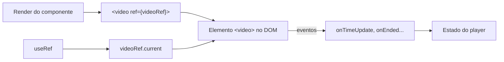

# Manipulação de multimídia no React

## Introdução

**Multimídia** no frontend inclui áudio, vídeo e imagens. Em React, você exibe e controla esses elementos usando as tags HTML nativas (``, `<audio>`, `<video>`) e, quando precisa de controle programático, a **ref** para acessar o elemento DOM e chamar métodos como `play()`, `pause()`, ou alterar `currentTime` e `volume`.

> Lembrete do React 19: em componentes funcionais, a `ref` chega como uma **prop normal** — não é mais necessário `forwardRef`.

---

## Imagens

- **Exibição**: use `` com a URL vinda de estado ou props. Para preview de arquivo local antes do upload, use **FileReader**: `readAsDataURL(file)` e defina o resultado no estado para usar como `src`.
- **Lazy loading**: o atributo nativo `loading="lazy"` em `` adia o carregamento até que a imagem se aproxime da viewport. Em listas grandes, isso melhora a performance.
- **Galeria**: mantenha uma lista de URLs (ou arquivos) no estado e renderize várias `` ou um componente de galeria que permita ampliar (modal ou lightbox).

---

## Áudio e vídeo

- **Tags**: `<audio>` e `<video>` aceitam `src` ou elementos `<source>`. Atributos comuns: `controls`, `autoplay`, `loop`, `muted`. No React, você pode controlar `src`, `currentTime`, `volume` e eventos como `onTimeUpdate`, `onEnded`.
- **Ref para controle**: crie uma ref com `useRef()` e passe para o elemento (`ref={videoRef}`). Então use `videoRef.current.play()`, `videoRef.current.pause()`, `videoRef.current.currentTime = 0` etc.
- **Estado de reprodução**: guarde em estado se está tocando ou pausado, tempo atual e duração, e atualize via `onTimeUpdate` e `onLoadedMetadata` para exibir barra de progresso e tempo na UI.

---

## Boas práticas

- Sempre forneça `alt` em imagens para acessibilidade.
- Para vídeos/áudio em produção, considere formatos e codecs compatíveis com os navegadores alvo; use múltiplos `<source>` se necessário.
- Em listas grandes de mídia, evite carregar todos os recursos de uma vez; use lazy loading ou virtualização.

---

## Conclusão

Manipulação de multimídia em React usa as tags HTML nativas e refs quando for preciso controle programático. No [tutorial-multimidia.md](tutorial-multimidia.md) você construirá um player de áudio/vídeo com botões play/pause e uma galeria simples de imagens.
