# Curso de ReactJS (React 19)

Curso didático de ReactJS com embasamento teórico e tutoriais práticos para construir frontends ricos. Todo o material está alinhado à **última versão do React** (19.x) e às novas APIs introduzidas pela documentação oficial em [react.dev](https://react.dev/reference/react). Ao final, você será capaz de criar sistemas com autenticação, manipulação de arquivos, integração com APIs, multimídia, layouts profissionais, rotas e gerenciamento de estado.

## Pré-requisitos

- Conhecimento básico de **HTML**, **CSS** e **JavaScript** (ES6+)
- **Node.js 20.19+** e **npm** instalados ([nodejs.org](https://nodejs.org))
- Editor de código (recomendado: VS Code ou Cursor)

## Como usar os materiais

- Cada módulo contém arquivos de **conceitos** (teoria) e **tutoriais** (prático passo a passo).
- Estude a teoria antes de fazer o tutorial correspondente.
- Nos tutoriais, siga os passos na ordem e leia a seção "Explicação dos principais elementos" para entender o que foi implementado.
- Execute os projetos localmente com `npm run dev`. Os tutoriais usam **Vite 8** e **React 19**.

## Mapa do curso

```mermaid
flowchart LR
    A[01 Introdução] --> B[02 Componentes]
    B --> C[03 Ciclo de vida]
    C --> D[04 Hooks]
    D --> E[05 Estado]
    E --> F[06 Rotas]
    F --> G[07 Layouts]
    G --> H[08 APIs]
    H --> I[09 Autenticação]
    I --> J[10 Arquivos]
    J --> K[11 Multimídia]
    K --> L[12 Bibliotecas]
```

## Estrutura do curso

| Módulo | Conteúdo |
|--------|----------|
| [01 - Introdução](01-introducao/) | O que é React, JSX, Virtual DOM, React Compiler e primeiro projeto |
| [02 - Componentes](02-componentes/) | Componentes, props, composição, `ref` como prop |
| [03 - Ciclo de vida](03-ciclo-de-vida/) | Montagem, atualização, desmontagem e `useEffect` |
| [04 - Hooks](04-hooks/) | `useState`, `useEffect`, `useReducer`, `useMemo`, `useCallback`, `useContext`, **`useActionState`**, **`useFormStatus`**, **`useOptimistic`**, **`use`** |
| [05 - Gerenciamento de estado](05-gerenciamento-estado/) | Estado local vs global, Context API (novo `<Context>`), padrões |
| [06 - Rotas](06-rotas/) | React Router v7, SPA, rotas protegidas |
| [07 - Layouts](07-layouts/) | CSS Modules, Flexbox, Grid, responsividade |
| [08 - Integração com APIs](08-integracao-apis/) | REST, fetch/axios, **Actions** e hook `use()` |
| [09 - Autenticação](09-autenticacao/) | Login com `useActionState`, tokens, rotas protegidas |
| [10 - Arquivos](10-arquivos/) | Upload com `<form action>` + `useFormStatus`, download, File API |
| [11 - Multimídia](11-multimidia/) | Áudio, vídeo, imagens e refs |
| [12 - Bibliotecas](12-bibliotecas/) | Ecossistema React (Router v7, TanStack Query, etc.) |
| [Recursos](recursos/) | Glossário e referências |

## Novidades do React 19 cobertas no curso

- **Actions**: funções síncronas/assíncronas passadas para `<form action={...}>` ou `formAction`, que gerenciam automaticamente `pending`, `error` e redirecionamentos.
- **`useActionState`**: estado derivado do retorno de uma Action (substitui vários `useState` em formulários).
- **`useFormStatus`**: permite que um botão filho leia o status do `<form>` pai.
- **`useOptimistic`**: atualização otimista da UI durante uma Action.
- **`use`**: lê valores de Promises e de Context dentro do render; pode ser usado dentro de condicionais (diferente dos outros hooks).
- **`ref` como prop**: componentes funcionais recebem `ref` diretamente como prop, sem `forwardRef`.
- **`<Context>` como Provider**: `<MyContext value={...}>` substitui `<MyContext.Provider value={...}>`.
- **Document Metadata**: `<title>`, `<meta>` e `<link>` podem ser renderizados em qualquer componente; o React os hoista para o `<head>`.
- **React Compiler**: otimizador opt-in que memoriza componentes/valores automaticamente, reduzindo a necessidade de `useMemo`/`useCallback`.

## Objetivos de aprendizagem

- Criar sistemas com autenticação (incluindo Actions)
- Criar sistemas com envio e manipulação de arquivos
- Integração com APIs REST
- Manipulação de multimídia
- Construir layouts responsivos com CSS Modules
- Entender componentes e composição
- Dominar todos os hooks essenciais do React 19
- Entender o ciclo de vida dos componentes funcionais
- Criar rotas (React Router v7)
- Gerenciar estado local e global
- Conhecer o ecossistema moderno do React
