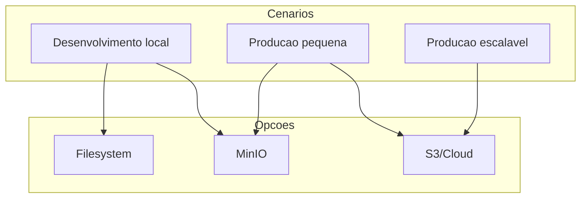

# Comparação, decisão e boas práticas

## Resumo comparativo

| Critério            | Filesystem        | MinIO                 | S3 / nuvem        |
|---------------------|-------------------|------------------------|-------------------|
| **Custo**           | Apenas disco      | Infra + manutenção     | Pago por uso      |
| **Escalabilidade**  | Uma instância     | Cluster possível      | Muito alta        |
| **Múltiplas instâncias** | Não recomendado | Sim                   | Sim               |
| **Backup/durabilidade** | Sob sua responsabilidade | Sob sua responsabilidade | Oferecido pelo provedor |
| **Complexidade**    | Baixa             | Média                  | Média (APIs, IAM) |
| **Lock-in**         | Nenhum            | API S3 (portável)      | Provedor          |
| **Uso típico**      | Dev, MVP, único servidor | Produção pequena/média, self-hosted | Qualquer escala, multi-região |

---

## Critérios de decisão

1. **Número de servidores**: se a aplicação roda em mais de uma instância (load balancer), arquivos no disco de uma máquina não são vistos pelas outras. Prefira **MinIO** ou **S3**.
2. **Orçamento e operação**: sem custo de nuvem e com capacidade de manter servidor, **MinIO** ou **filesystem** (se for só uma instância) são viáveis. Com orçamento para cloud e desejo de não gerenciar storage, **S3** (ou equivalente) é comum.
3. **Crescimento**: se o volume de arquivos e usuários pode crescer muito, **object storage** (MinIO ou S3) escala melhor que disco no servidor de aplicação.
4. **Portabilidade**: código que usa a **API S3** (com SDK MinIO ou AWS) pode trocar de MinIO para S3 (ou LocalStack) mudando endpoint e credenciais; o filesystem não é portável entre provedores.

---

## Boas práticas

### Segurança e validação

- **Sempre validar no backend**: tipo (extensão e/ou content-type), tamanho máximo e, quando fizer sentido, conteúdo (ex.: assinatura de imagem). Não confie apenas no frontend.
- **Não expor credenciais**: use variáveis de ambiente (ou secrets) para access key e secret key; nunca commite no repositório.
- **HTTPS em produção**: sirva a API e os endpoints de download por HTTPS para evitar interceptação.

### Armazenamento

- **Não guardar arquivos no repositório**: a pasta de uploads (no filesystem) deve estar no `.gitignore`. Dados de usuário não são código.
- **Nomes únicos**: gere nomes únicos (UUID, timestamp + aleatório) para evitar sobrescrita e conflitos.
- **Limite de tamanho**: defina um tamanho máximo por arquivo e por requisição (ex.: Multer `limits.fileSize`); proteja contra uploads que encham disco ou consumam banda.

### Integração com o frontend

- O fluxo de **upload** no navegador (input file, FormData, envio para a API) está coberto no curso [React — Arquivos](../frontend/reactjs/10-arquivos/). O backend que você implementou nos módulos 02, 03 e 04 recebe esse POST e persiste no disco, MinIO ou S3.
- Para **download**, o frontend pode: abrir em nova aba a URL retornada pela API (ex.: `/download/:key` que redireciona para presigned URL) ou usar `fetch` + blob e disparar download com um link temporário.

### Presigned URLs

- Use **presigned URLs** para download (e, quando aplicável, upload direto do navegador para o object storage): o backend gera a URL e a devolve ao cliente; o cliente acessa o MinIO/S3 diretamente, sem o backend transferir os bytes, reduzindo carga e latência.

---

## Diagrama de decisão

---

## Conclusão

Use **filesystem** para desenvolvimento ou aplicações com um único servidor e pouco volume. Adote **MinIO** para produção self-hosted ou para desenvolver já com API S3. Escolha **S3** (ou outro object storage em nuvem) quando precisar de escala, multi-região ou quiser delegar durabilidade e backup. Aplicando as boas práticas acima, você reduz riscos de segurança e falhas de armazenamento em qualquer uma das abordagens.
